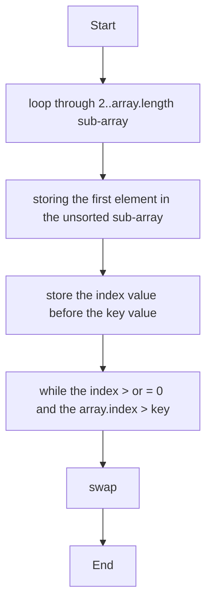

#  insertion sort
#### status: 
#### created: 2022-06-29
---
#### introduction
1. *insertion sort*  uses an *incremental* **paradigm** 
2. it's fast for small input size
3. the insertion sort algorithms sort *in place*
4. time complexity of O(n2)

#### how does it work
 Insertion sort works the way many people sort a hand of **playing cards**.

#### analysis
INSERTION SORT can take different amounts of time to sort two input sequences of the same size depending on how nearly sorted they already are

#### flowchart 

## psuedocode
```
1 for j = 2 to A.length
2     key = A[j]
3     // Insert A[j] into the sorted sequence A[1..j-1]
4     i = j-1
5     while i > 0 and A[i] > key
6         A[i+1] = A[i]
7         i = i-1 
8     A[i+1] = key 
```

## the time complexity

	![[code.png]]


---
### references
[[@cormenIntroductionAlgorithms2009]]